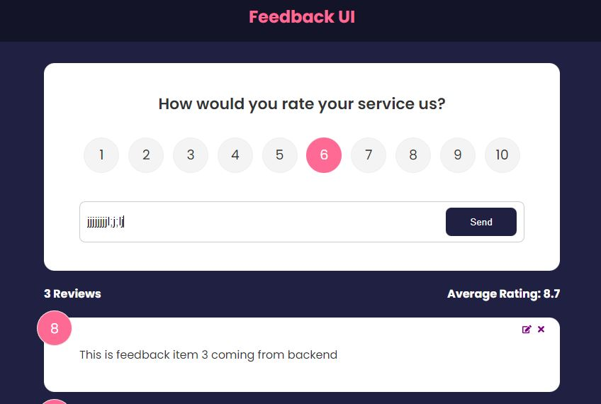

<!-- #  Feedback FullStack App -->

A  fullstack feedback application that takes feedback and runs a mock json server(backend API) to take and store input in **database**. The endpoints are hit with **HTTP requests** to **get**, **add**, **delete**, **update** feedback in UI. 

The technologies used are **HTML, CSS** and **javascript** for creating and designing web application, **react.js** for it's declarative approach, **react router** for routing pages, **font awesome** library for icons, npm packages like **unique universal identifier(uuid)** for iteration and **framer motion package** for animation, and last but not least API platform **postman** to test the mock backend.

 - **Context API** has been used to avoid the issue of prop drilling. 
 - **Installation** of json server package and adding a script to run it as a gateway to database was essential to mock backend. 
 - **CRUD** operations to backend were aided using the **fetch API** along with **async** and **await** keywords.  
 - Interaction with the application was realized by deploying it to netlify. 
 - Any new feature to implement has not been thought of yet.

**Note**

This project is an **extension** of [front end feedback app repo](https://github.com/starlove54/feedback-app-frontend).


##  Installation and Running
Clone the repository with the following command in command line
```
git clone https://github.com/starlove54/feedback-app-fullstack.git
```
Install npm 
```
npm install
```
Run both the client and server concurrently 
```
npm run dev
```


## Usage
Once the server starts (go through installation and running) feedback from the server is displayed. Type in the desired feedback that would be sent to the database once the send button is pressed. One can also edit or delete an existing feedback using the icons.



## Contributing

Pull requests are welcome. For major changes, please open an issue first
to discuss what you would like to change.

## Credits and Acknowledgement
Please check out and follow the amazing person Brad Traversy on his you tube channel [traversy media](https://www.youtube.com/@TraversyMedia) and [github profile](https://github.com/bradtraversy).


## License

MIT License

Copyright (c) [2022] [Anubhav Negi]

Permission is hereby granted, free of charge, to any person obtaining a copy
of this software and associated documentation files (the "Software"), to deal
in the Software without restriction, including without limitation the rights
to use, copy, modify, merge, publish, distribute, sublicense, and/or sell
copies of the Software, and to permit persons to whom the Software is
furnished to do so, subject to the following conditions:

The above copyright notice and this permission notice shall be included in all
copies or substantial portions of the Software.

THE SOFTWARE IS PROVIDED "AS IS", WITHOUT WARRANTY OF ANY KIND, EXPRESS OR
IMPLIED, INCLUDING BUT NOT LIMITED TO THE WARRANTIES OF MERCHANTABILITY,
FITNESS FOR A PARTICULAR PURPOSE AND NONINFRINGEMENT. IN NO EVENT SHALL THE
AUTHORS OR COPYRIGHT HOLDERS BE LIABLE FOR ANY CLAIM, DAMAGES OR OTHER
LIABILITY, WHETHER IN AN ACTION OF CONTRACT, TORT OR OTHERWISE, ARISING FROM,
OUT OF OR IN CONNECTION WITH THE SOFTWARE OR THE USE OR OTHER DEALINGS IN THE
SOFTWARE.


